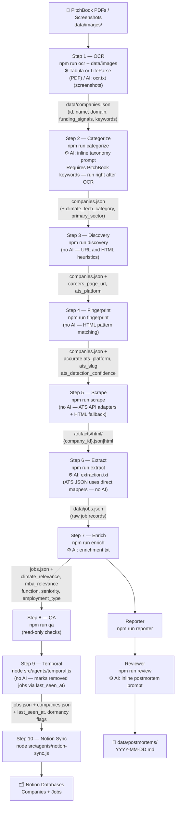
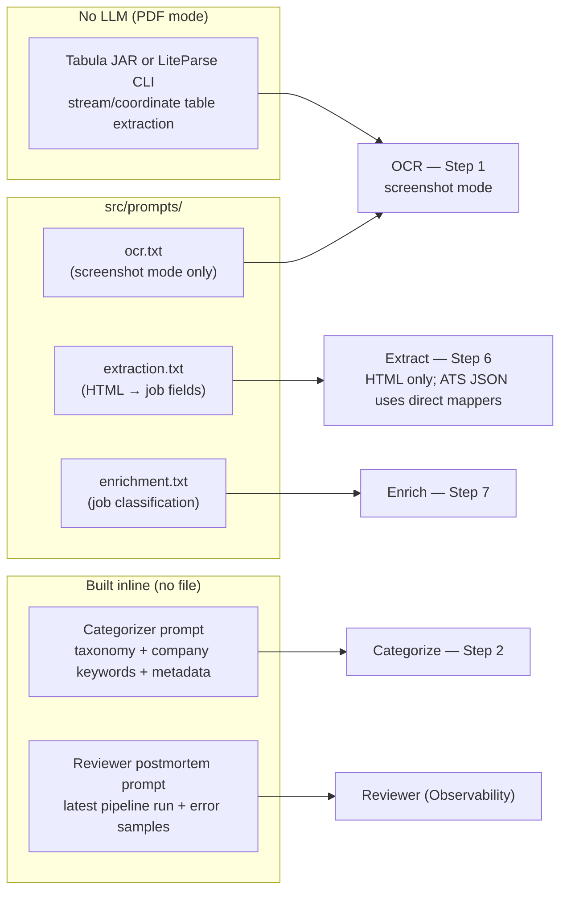

# CSB Job Board

Automatically finds and tracks job listings at climate-tech companies — pulled from PitchBook exports, enriched with AI, and synced to a Notion database you can search and filter.

**What you get:** A live Notion database of open roles at climate/clean-tech companies, each tagged with job function, seniority, location type, MBA relevance (`low|medium|high`), a climate relevance flag, and an industry category from the Climate Tech Map taxonomy. New runs update existing records and mark removed jobs.

---

## Two ways to run

**Streaming pipeline (recommended).** One command runs every stage (**profile → discovery → fingerprint → scrape → extract → enrich → categorize**) concurrently per company (`src/orchestrator.js`). Each company flows through independently, so one slow company can't block the rest. Companies are tagged **cold** or **warm** on each enqueue so the orchestrator can skip redundant extract/enrich work and use a smaller extraction prompt when the LLM fallback runs — see [Cold vs warm (streaming pipeline)](#cold-vs-warm-streaming-pipeline). Historical implementation slices: [docs/archive/lanes-slices-2026-04-21.md](docs/archive/lanes-slices-2026-04-21.md).

```bash
npm run pipeline                  # full set
npm run pipeline -- --limit=20    # first 20 companies (CLI accepts --limit=N form; don't pass a separate space-separated argument)
```

**Step-by-step (classic).** Run each stage as its own CLI — useful when you're iterating on one stage (e.g. tweaking discovery heuristics) or just want tight control.

```bash
npm run discovery
npm run scrape
npm run extract
# ...
```

Both modes share the same data files; you can mix and match across runs.

## Live monitoring

While the pipeline runs (or any individual stage), watch what's happening:

```bash
node scripts/pipeline-status.js --watch   # stage counts across all companies
node scripts/pipeline-report.js --watch   # live queue depths + event aggregates
```

Every stage attempt emits a structured event to `data/runs/pipeline-events-{run_id}.jsonl` (retention: last 30 runs). Each event carries `duration_ms`, a `failure_class` (timeout/dns/http_4xx/5xx/blocked/llm_parse_fail/llm_rate_limit/empty_result), and stage-specific extras. The report script aggregates these into per-stage p50/p95 latency, success/no_result/failure counts, top failure reasons, slowest 10 companies, and recent failures — works live or historically (`--all`, `--company=acme`).

Details in [Streaming Pipeline (orchestrator)](#streaming-pipeline-orchestrator) below.

---

## Table of Contents

1. [Prerequisites](#prerequisites)
2. [Setup](#setup-one-time)
3. [Exporting from PitchBook](#exporting-from-pitchbook)
4. [Pipeline Overview](#pipeline-overview)
5. [Step-by-Step Reference](#step-by-step-reference)
   - [Step 1 — OCR: Import companies from PitchBook](#step-1--ocr-import-companies-from-pitchbook)
   - [Step 2 — Categorize: Tag companies by climate sector](#step-2--categorize-tag-companies-by-climate-sector)
   - [Step 3 — Discovery: Find careers pages](#step-3--discovery-find-careers-pages)
   - [Step 4 — Fingerprint: Identify job platforms](#step-4--fingerprint-identify-job-platforms)
   - [Step 5 — Scrape: Fetch job listings](#step-5--scrape-fetch-job-listings)
   - [Step 6 — Extract: Parse jobs into structured records](#step-6--extract-parse-jobs-into-structured-records)
   - [Step 7 — Enrich: Classify jobs with AI](#step-7--enrich-classify-jobs-with-ai)
   - [Step 8 — QA: Spot-check before syncing](#step-8--qa-spot-check-before-syncing)
   - [Step 9 — Temporal: Track job status over time](#step-9--temporal-track-job-status-over-time)
   - [Step 10 — Notion Sync: Push to Notion](#step-10--notion-sync-push-to-notion)
   - [Observability: Reporter + Reviewer](#observability-reporter--reviewer)
6. [Streaming Pipeline (orchestrator)](#streaming-pipeline-orchestrator)
   - [Cold vs warm (streaming pipeline)](#cold-vs-warm-streaming-pipeline)
7. [Prompt Reference](#prompt-reference)
8. [Re-running Patterns](#re-running-patterns)
9. [Reading Results in Notion](#reading-results-in-notion)
10. [Troubleshooting](#troubleshooting)
11. [Data Files](#data-files)
12. [Security](#security)
13. [Documentation](#documentation)

---

## Prerequisites

- **PitchBook access** — to export company lists as PDFs or screenshots
- **Gemini API key** (paid tier) — powers OCR and job classification. Get one at [aistudio.google.com](https://aistudio.google.com). Alternatively, an **Anthropic API key** runs all LLM-powered agents through Claude Haiku (see [Config / Multi-provider](#config--multi-provider))
- **Notion account** — two databases: one for Companies, one for Jobs. Run the setup script once to provision them (see Setup below)
- **Node.js 18+** — check with `node --version`
- **WRDS account** (optional) — for direct PitchBook database access via `wrds-ingest`. Requires IP whitelisting through your institution. Get access at [wrds-web.wharton.upenn.edu](https://wrds-web.wharton.upenn.edu)
- **poppler-utils** — for PDF text extraction (`brew install poppler` on macOS)

---

## Setup (one time)

**1. Clone and install**
```bash
git clone <repo-url>
cd csb-job-board
npm install
```

**2. Create your `.env.local` file**
```
GEMINI_API_KEY=your-gemini-key
NOTION_API_KEY=your-notion-integration-key
NOTION_COMPANIES_DB_ID=your-companies-db-id
NOTION_JOBS_DB_ID=your-jobs-db-id
WRDS_USERNAME=your-wharton-username       # optional — only for wrds-ingest
WRDS_PASSWORD=your-wharton-password       # optional — only for wrds-ingest
```

To get Notion credentials: create an internal integration at [notion.so/my-integrations](https://notion.so/my-integrations), share both databases with it, and copy the database IDs from the page URLs.

**3. Provision Notion databases**
```bash
node src/agents/notion-setup.js
```
Adds all required properties to your Notion databases. Safe to re-run.

---

## Exporting from PitchBook

Before running the pipeline, you need a PitchBook company list exported as a PDF. Here's how to configure the list view and export it correctly so the OCR agent can parse it.

### Step 1 — Apply screener filters

Navigate to **Companies** → **Companies & Deals Screener** (or open a saved search). The filters used for this project:

| Filter | Value |
|---|---|
| Deal Date | From: 01-Apr-2025 (adjust as needed) |
| Ownership Status | Privately Held (backing), Privately Held (no backing), In IPO Registration |
| Location | United States |
| Verticals | Climate Tech, CleanTech |
| Number of Employees | Max: 600 |

Set these via the **Modify All Criteria** panel at the top of the screener. The current list has ~1,697 companies matching these filters.

### Step 2 — Configure columns

Click **Edit table** (top right of the results table) to open the column editor. Remove any default columns and add exactly these, in this order:

1. Company Name
2. Keywords
3. Website
4. Employees
5. Last Financing Date
6. Last Financing Deal Type
7. Last Financing Size
8. Total Raised
9. HQ Location

Click **Apply** to update the table view.

### Step 3 — Adjust column widths

PDF exports have a fixed page width — if columns are too wide, data gets truncated. Before exporting:

- Give **Keywords** the most horizontal space — this is the highest-signal field for categorization and truncates easily
- Shrink **Employees**, **Last Financing Size**, and **Total Raised** — these are short numeric values
- **Last Financing Date** and **HQ Location** can be moderately narrow

Drag column dividers in the header row to resize. The goal is to fit all 9 columns visible on a landscape page without truncation.

### Step 4 — Export as PDF

PitchBook's native export sometimes cuts off columns. The most reliable method:

1. Press `Cmd + P` (Mac) or `Ctrl + P` (Windows) to open the browser print dialog
2. Set **Layout** to **Landscape**
3. Set **Margins** to **Minimum** (or None)
4. Set **Destination** to **Save as PDF**
5. Disable **Background graphics**
6. Click **Save**

> If columns are still truncating, zoom out your browser (e.g. `Cmd + -`) before printing until all columns fit across the page width, then print to PDF.

Save the file to `data/images/` with a descriptive name indicating the row range (e.g. `1-250 climate companies.pdf`, `251-500 climate companies.pdf`).

**Pagination tip:** By default PitchBook shows 25 rows per page. Use the **Show** dropdown in the bottom-left of the table to set it to **250** — the maximum. This means each page (and each PDF export) covers up to 250 companies. Page through the results (Prev / 1 / 2 / 3 … / Next) and print each page to a separate PDF.

### Machine-readable export spec

```json
{
  "task": "pitchbook_pdf_export",
  "screener_filters": {
    "deal_date_from": "01-Apr-2025",
    "ownership_status": ["Privately Held (backing)", "Privately Held (no backing)", "In IPO Registration"],
    "location": "United States",
    "verticals": ["Climate Tech", "CleanTech"],
    "max_employees": 600
  },
  "columns": [
    "Company Name",
    "Keywords",
    "Website",
    "Employees",
    "Last Financing Date",
    "Last Financing Deal Type",
    "Last Financing Size",
    "Total Raised",
    "HQ Location"
  ],
  "column_width_guidance": {
    "Keywords": "maximize",
    "Employees": "minimize",
    "Last Financing Size": "minimize",
    "Total Raised": "minimize"
  },
  "export": {
    "method": "browser_print_to_pdf",
    "layout": "landscape",
    "margins": "minimum",
    "background_graphics": false,
    "output_dir": "data/images/",
    "naming_convention": "{row_start}-{row_end} climate companies.pdf",
    "rows_per_page": 250,
    "pagination_note": "Set Show dropdown (bottom-left) to 250 before exporting. Each page = one PDF."
  }
}
```

---

## Pipeline Overview

The pipeline is a linear DAG. Each step reads from files written by the previous step — they're all idempotent and can be re-run independently.



### Where prompts are injected



---

## Step-by-Step Reference

### Step 0 — WRDS Ingest: Import companies from PitchBook database (optional)

**What it does:** Connects directly to the WRDS PitchBook PostgreSQL database and extracts company profiles and funding signals. An alternative to the PDF export → OCR workflow. Both can run — records merge by domain.

**No AI involved** — direct SQL queries against WRDS PostgreSQL.

**Prerequisites:** WRDS account with IP whitelisting, `pg` npm package (`npm install pg`), column map at `artifacts/wrds-column-map.json` (run `npm run wrds-scout` first to discover schema).

**Input:** WRDS PostgreSQL database (`pitchbk_companies_deals` schema)

**Output:** `data/companies.json` — same schema as OCR output, merged with existing records

```bash
# First time: discover the WRDS schema and create column map
npm run wrds-scout

# Full extraction (first run or reset)
npm run wrds-ingest -- --full

# Delta update (only new deals since last extraction)
npm run wrds-ingest

# Preview without writing
npm run wrds-ingest -- --dry-run --verbose
```

**Schema fields produced:** Same as Step 1 (OCR) — `id`, `name`, `domain`, `funding_signals`, `company_profile` — plus PitchBook classification fields used by the taxonomy mapper: `wrds_company_id`, `emerging_spaces`, `pitchbook_verticals`, `pitchbook_industry_code`, `pitchbook_industry_group`, `pitchbook_industry_sector`, `pitchbook_description`. These structured classifications enable deterministic categorization (Lane 1) without LLM calls — see [Dual-Lane Architecture](docs/wrds-dual-lane-architecture.md).

> **When to use WRDS vs OCR:** Use WRDS for automated, repeatable delta updates with rich PitchBook classifications (Emerging Spaces, Verticals, Industry Codes). Use OCR when you need PitchBook keywords from the screener UI or when WRDS access is unavailable. Both sources merge cleanly by domain.

---

### Step 1 — OCR: Import companies from PitchBook

**What it does:** Reads PitchBook exports (PDFs or screenshots) and extracts structured company records into `data/companies.json`. Re-running merges new companies with existing ones by domain — no duplicates.

**Input:** `data/images/` — drop PDFs or PNG/JPG screenshots here

**Output:** `data/companies.json` — company list with identity, funding signals, HQ, headcount

**PDF mode (primary):** Uses [Tabula](https://tabula.technology/) (`tabula.jar`) by default — no LLM involved. Runs in stream mode (`-r`) since PitchBook exports have no visible grid lines. Processes each page individually, scans page 1 by text to find the column header row (skipping the PitchBook nav chrome above it), then maps data cells to columns geometrically by x-coordinate. PitchBook's row numbers prepended to company names (e.g. `"42Acme Corp"`) are stripped automatically.

**Optional PDF backend:** Set `OCR_PDF_BACKEND=liteparse` to use [LiteParse](https://developers.llamaindex.ai/liteparse/) instead of Tabula. Install the CLI first (`npm install -g @llamaindex/liteparse`). Override the executable name/path with `LITEPARSE_COMMAND` if needed.

**Screenshot mode (fallback):** Sends PNG/JPG images to the LLM using `src/prompts/ocr.txt`.

```bash
# Recommended: point at the directory (handles both PDFs and screenshots)
npm run ocr -- data/images

# Single PDF
node src/agents/ocr.js "data/images/1-250 climate companies.pdf"

# Dry-run: preview output without writing to companies.json
npm run ocr -- data/images --dry-run
```

**Schema fields produced:**
```
id                  — derived from domain (slugified), or name hash if no domain
name                — company name as extracted from PitchBook
domain              — website domain (e.g. "carbonplan.org")
funding_signals     — array of { date, deal_type, size_mm, total_raised_mm }
company_profile     — { sector, hq, employees, keywords }
```

---

### Step 2 — Categorize: Tag companies by climate sector

**What it does:** Assigns each company a climate-tech industry category from `data/climate-tech-map-industry-categories.json`. Uses a **three-lane routing strategy** (via `src/agents/taxonomy-mapper.js`):

| Lane | Trigger | Method | LLM? |
|---|---|---|---|
| **1 — Fast** | Company has PitchBook Emerging Space, Vertical, or Industry Code matching `data/pitchbook-taxonomy-map.json` | Deterministic dictionary cascade | No |
| **2 — Medium** | Company in WRDS with description but no deterministic match | LLM on PitchBook description + classifications | Yes (lightweight) |
| **3 — Cold** | Company not in WRDS or description too short | Full LLM with PitchBook keywords + company metadata | Yes |

See [docs/wrds-dual-lane-architecture.md](docs/wrds-dual-lane-architecture.md) for full routing logic and the PitchBook classification cascade.

**Prompt injected:** Built inline — taxonomy categories + company context (Lane 2: PitchBook description + classifications; Lane 3: PitchBook keywords + scraped metadata)

**Input:** `data/companies.json` + `data/climate-tech-map-industry-categories.json` + `data/pitchbook-taxonomy-map.json` (jobs.json optional)

**Output:** `data/companies.json` updated with:
```
climate_tech_category   — e.g. "Solar Energy", "Grid Infrastructure"
primary_sector          — e.g. "Clean Power"
opportunity_area        — e.g. "Generation"
category_confidence     — high | medium | low
category_resolver       — emerging_space | vertical | industry_code | rule | llm_wrds | llm
category_source         — wrds_fast | wrds_medium | cold
```

> **Taxonomy note:** `data/climate-tech-map-industry-categories.json` is the canonical taxonomy file. `data/pitchbook-taxonomy-map.json` maps PitchBook classifications to it. Do not auto-apply changes to either — edits require human review.

---

### Step 3 — Discovery: Find careers pages

**What it does:** For each company in `companies.json`, attempts to discover its careers page URL. Skips companies already marked `careers_page_reachable: true` (use `--force` to re-run all).

**Input:** `data/companies.json`

**Output:** `data/companies.json` updated with `careers_page_url`, `careers_page_reachable`, `careers_page_discovery_method`, `ats_platform`

**Discovery order (per company):**
1. Standard path probing (`/careers`, `/jobs`, `/about/careers`, `/join`, etc.) — all paths probed in parallel; returns on first hit
2. ATS slug guessing — checks `boards.greenhouse.io/{slug}`, `jobs.lever.co/{slug}`, `jobs.ashby.com/{slug}`
3. Homepage `<a href>` link scan — fetches homepage, finds career-related links
4. Sitemap scan — checks `/sitemap.xml`, `/sitemap_index.xml`
```bash
npm run discovery

# Re-run all (including already-discovered)
npm run discovery -- --force

# Limit to first N companies (useful for testing)
npm run discovery -- --limit=20

# Verbose output (shows each method tried)
npm run discovery -- --verbose
```

---

### Step 4 — Fingerprint: Identify job platforms

**What it does:** Fetches each company's homepage and careers page and scans HTML for ATS fingerprints (script tags, API calls, CSS classes). Updates `ats_platform` and `ats_slug` so the scraper can route to the right API adapter.

**No AI involved** — purely pattern matching against known ATS signatures.

**Input:** `data/companies.json` — companies with `careers_page_reachable: true`

**Output:** `data/companies.json` updated with accurate `ats_platform` and `ats_slug`

**Detects:** Greenhouse, Lever, Ashby, Workday, Workable, Recruitee, Teamtailor, BambooHR,
Rippling, Jobvite, iCIMS, SmartRecruiters

```bash
npm run fingerprint
```

> **Why this step matters:** The scraper trusts `ats_platform` from this step for provider routing. Accurate ATS detection means structured JSON from official APIs instead of fragile HTML parsing.

> **ATS platforms vs job aggregators:** All supported platforms above are native ATS systems —
> companies use them directly to manage their own hiring pipelines. Jobs scraped from these
> platforms are original postings, not reposts. This is intentional: aggregators (LinkedIn,
> Indeed, Glassdoor, Wellfound) repost jobs from ATS platforms and would cause double-counting.
> Never add an aggregator as an ATS adapter. To confirm a detection is real (not a stale HTML
> reference), the fingerprinter records `ats_detection_confidence: 'url'` when the company's
> careers URL is hosted on the ATS domain, vs `'html'` when detected only from page content.
> The scraper falls back to direct HTML on a 404 from any ATS API.

---

### Step 5 — Scrape: Fetch job listings

**What it does:** Fetches raw job data from each company's careers page. Routes by `ats_platform` — uses official APIs when available, falls back to direct HTML, and uses headless Chromium (Playwright) as a last resort for JS-rendered pages.

**No AI involved** — HTTP fetch + API adapters.

**Input:** `data/companies.json` — companies with `careers_page_reachable: true`

**Output:**
- `artifacts/html/{company_id}.json` — structured job data (Greenhouse / Lever / Ashby / Workday)
- `artifacts/html/{company_id}.html` — raw HTML (direct scrape)
- `artifacts/html/{company_id}.playwright.html` — Playwright-rendered HTML fallback
- `data/scrape_runs.json` — per-run log with status, provider, and error info

**Provider routing:**
| ATS Platform | Method | Concurrency |
|---|---|---|
| Greenhouse | Official API (`boards-api.greenhouse.io`) | 5 |
| Lever | Official API (`api.lever.co`) | 5 |
| Ashby | Official API (`api.ashbyhq.com`) | 5 |
| Workday | Official API | 2 |
| Workable    | workable_api   | 3           |
| Recruitee   | recruitee_api  | 3           |
| Teamtailor  | teamtailor_api | 3           |
| BambooHR    | bamboohr_html  | 3           |
| Custom / Unknown | Direct HTML fetch + Playwright fallback | 3 |

```bash
npm run scrape
```

**Playwright fallback** fires automatically when: response is 4xx, body is under 5KB, or content-type is not HTML. Skips if the page matches known blocker patterns (CAPTCHA, cookie walls).

**Signature gate (ATS only).** Before scraping a company on a known ATS, a cheap preflight pulls the job-ID list and hashes it. If the hash matches `last_scrape_signature` on `companies.json`, the run short-circuits: no full scrape, no extract, no enrich — the temporal stage just re-stamps `last_seen_at`. Emits a `skipped_signature_match` event for the reporter. Raw-HTML companies bypass the gate (trivial diffs would churn the signature).

---

### Step 6 — Extract: Parse jobs into structured records

**What it does:** Converts raw artifacts into structured job records in `data/jobs.json`. Three-tier resolution:
1. **ATS API JSON** → direct field mappers (no LLM).
2. **HTML DOM adapters** → deterministic extractors for the top 3 shapes (anchor job-link lists, WordPress-ish, Webflow). Covers ~82% of HTML artifacts. See `src/agents/extraction/html-adapters/` and [the shape audit](docs/archive/extract-html-shape-audit-2026-04-20.md).
3. **LLM fallback** → only when `EXTRACTION_LLM_FALLBACK=1` and the HTML shape is `other` (`src/agents/extraction.js`). Uses `src/prompts/extraction.txt` by default; if the company is on the **warm** lane and there are existing job URLs (as passed from the orchestrator), `resolveExtractionPromptPath` switches to `src/prompts/extraction-warm.txt` so the model sees known URLs and focuses on new or changed rows.

**Prompt injected:** `src/prompts/extraction.txt` for cold / no known URLs; `src/prompts/extraction-warm.txt` when the orchestrator passes existing job URLs on the warm lane — LLM fallback only (`EXTRACTION_LLM_FALLBACK=1`).

**Input:** `artifacts/html/` — all artifacts from Step 4

**Output:** `data/jobs.json` — deduplicated job records (by `source_url` + `description_hash`)

```bash
# All companies
npm run extract

# Single company
node src/agents/extraction.js --company=<company-id>

# Single artifact file
node src/agents/extraction.js --input=artifacts/html/foo.html --base-url=https://foo.com --company="Foo Inc"

# Dry-run
npm run extract -- --dry-run
```

**Schema fields produced:**
```
id                  — hash of source_url + description
company_id          — links back to companies.json
job_title_raw       — title exactly as scraped
source_url          — direct link to the job posting
location_raw        — location string as shown
employment_type     — full_time | part_time | contract | intern | null
description_raw     — raw description text (first ~500 chars for HTML; full for API)
first_seen_at       — ISO timestamp of first extraction
last_seen_at        — ISO timestamp of most recent extraction
```

---

### Step 7 — Enrich: Classify jobs with AI

**What it does:** Classifies each job using the LLM. Skips jobs already enriched at the current prompt version unless `--force` is passed.

**Prompt injected:** `src/prompts/enrichment.txt`

**Input:** `data/jobs.json`

**Output:** `data/jobs.json` updated with classification fields

**Fields added:**
```
job_title_normalized    — standardized title (abbreviations expanded, level prefixes normalized)
job_function            — engineering | product | design | operations | sales | marketing |
                          finance | legal | hr | data_science | strategy | policy | supply_chain |
                          customer_success | other
seniority_level         — intern | entry | mid | senior | staff | director | vp | c_suite
location_type           — remote | hybrid | on_site | unknown
mba_relevance           — low | medium | high (see rubric below)
climate_relevance_confirmed — true | false
climate_relevance_reason    — one sentence explanation
```

```bash
npm run enrich

# 5x faster / lower cost: sends 5 jobs per LLM call
npm run enrich -- --batch-mode

# Re-classify jobs that errored on a previous run
npm run enrich -- --retry-errors

# Force re-classify everything (e.g. after editing enrichment.txt)
npm run enrich -- --force

# Tune concurrency and rate
npm run enrich -- --concurrency=5 --delay=1000
```

**Rate limiting:** Worker pool with `concurrency=3`, `delay=1500ms` between task starts, exponential backoff on 429/503, automatic fallback to `gemini-1.5-flash` on persistent failure.

> **Prompt versioning:** The enrichment prompt has a version constant (`ENRICHMENT_PROMPT_VERSION` in `src/agents/enricher.js`). Bump it after editing `enrichment.txt` to force re-enrichment of all jobs on the next run.

---

### Step 8 — QA: Spot-check before syncing

**What it does:** Read-only checks on `data/jobs.json`. Prints `[WARN]` lines for anything suspicious. Run this before Notion sync.

**No AI involved.**

**Checks:**
- Enrichment error rate (warns if >10%)
- Climate relevance distribution (warns if <30% confirmed)
- Missing required fields (`job_title_raw`, `source_url`, `company_id`)
- Jobs with no `mba_relevance`

```bash
npm run qa
```

---

### Step 9 — Temporal: Track job status over time

**What it does:** Compares the current job list against prior scrape runs to mark which jobs are still active, when they were removed, and how long they've been live. Also flags dormant companies (≥3 consecutive scrape runs with no jobs).

**No AI involved.**

**Input:** `data/jobs.json`, `data/scrape_runs.json`, `data/companies.json`

**Output:**
- `data/jobs.json` updated with `last_seen_at`, `removed_at`, `days_live`
- `data/companies.json` updated with `consecutive_empty_scrapes`, `dormant`

```bash
node src/agents/temporal.js

# Preview without writing
node src/agents/temporal.js --dry-run

# Verbose output
node src/agents/temporal.js --verbose
```

---

### Step 10 — Notion Sync: Push to Notion

**What it does:** Upserts all companies and jobs from the JSON files to Notion. Updates existing records by `id` — never duplicates. Uses a dynamic schema mapping that tolerates renamed Notion properties.

**No AI involved.**

**Input:** `data/companies.json`, `data/jobs.json`

**Output:** Notion Companies and Jobs databases updated

**Env vars required:** `NOTION_API_KEY`, `NOTION_COMPANIES_DB_ID`, `NOTION_JOBS_DB_ID`

```bash
node src/agents/notion-sync.js

# Dry-run: preview without writing
node src/agents/notion-sync.js --dry-run

# Only sync companies (skip jobs)
node src/agents/notion-sync.js --companies-only

# Only sync jobs
node src/agents/notion-sync.js --jobs-only
```

Rate-limited to ~3 req/s to stay within Notion API limits.

---

### Observability: Reporter + Reviewer

Run after any full pipeline run to get metrics and an AI-written postmortem.

**Reporter** — aggregates pipeline metrics into `data/runs/latest.json`:
```bash
npm run reporter
```
Tracks: per-provider scrape success rates, discovery yield, ATS distribution, enrichment error rate, climate relevance %, MBA relevance distribution, small body count.

**Reviewer** — reads `latest.json` + error samples → LLM writes a postmortem to `data/postmortems/YYYY-MM-DD.md`:
```bash
npm run review
```
Prompt built inline. Output: what went well, what failed and why, which stage had worst yield, one concrete prompt improvement suggestion.

> Reporter must run before Reviewer.

---

## Prompt Reference

| File | Used by | Purpose |
|---|---|---|
| `src/prompts/ocr.txt` | OCR Agent — image/screenshot mode | Instructs Gemini vision to extract PitchBook tabular data from a screenshot into a JSON array |
| `src/prompts/ocr-pdf.txt` | OCR Agent — PDF mode | Same goal but for `pdftotext`-extracted text; includes column truncation mappings and sidebar noise filtering |
| `src/prompts/extraction.txt` | Extraction Agent — HTML only | Extracts job listings (title, URL, location, type, description) from raw careers page HTML; strict anti-hallucination rules for URLs and descriptions |
| `src/prompts/enrichment.txt` | Enrichment Agent | Classifies a single job (or batch of 5 in `--batch-mode`) with function, seniority, location type, MBA relevance tier, climate relevance |

**Tuning tips:**
- Edit any prompt file and re-run the relevant agent.
- For enrichment: after editing `enrichment.txt`, bump `ENRICHMENT_PROMPT_VERSION` in `src/agents/enricher.js` and run `npm run enrich -- --force` to re-classify all jobs.
- Categorizer prompt is inline in its agent file (`src/agents/categorizer.js`).

---

## Config / Multi-provider

All model defaults and key lookups live in `src/config.js`. Override per-agent via `.env.local`:

```bash
# Provider selection (auto-detected from available keys if omitted)
LLM_PROVIDER=gemini          # or: anthropic

# Keys
GEMINI_API_KEY=...           # paid tier required for full runs
ANTHROPIC_API_KEY=...        # setting this alone routes all agents through Claude Haiku

# Per-agent model overrides (Gemini)
OCR_MODEL=gemini-2.5-flash-lite
EXTRACTION_MODEL=gemini-2.5-flash
ENRICHMENT_MODEL=gemini-2.5-flash

# OCR PDF backend
OCR_PDF_BACKEND=tabula       # or: liteparse
LITEPARSE_COMMAND=lit        # optional override, default "lit"

# Per-agent model overrides (Anthropic)
OCR_ANTHROPIC_MODEL=claude-haiku-4-5-20251001
EXTRACTION_ANTHROPIC_MODEL=claude-haiku-4-5-20251001
ENRICHMENT_ANTHROPIC_MODEL=claude-haiku-4-5-20251001
CATEGORIZER_ANTHROPIC_MODEL=claude-haiku-4-5-20251001
REVIEWER_ANTHROPIC_MODEL=claude-haiku-4-5-20251001

# PDF chunking (Step 1 — default: 8 pages per LLM call)
PDF_CHUNK_SIZE=8
```

---

## Streaming Pipeline (orchestrator)

Instead of running each stage sequentially across all companies, you can run them concurrently per-company. Each company flows through **profile → discovery → fingerprint → scrape → extract → enrich → categorize** independently (`STAGES` in `src/utils/pipeline-stages.js`); a slow company no longer blocks the other 500.

```bash
npm run pipeline                         # full set, all stages
npm run pipeline -- --limit 20           # first 20 companies only
npm run pipeline -- --stages=discovery,scrape
npm run pipeline -- --company=Acme,Bar
npm run pipeline -- --dry-run --verbose
```

### Cold vs warm (streaming pipeline)

These labels are **not** PitchBook concepts — they come from `classifyLane()` in `src/utils/pipeline-stages.js`:

| Lane | Rule in code | Plain language |
|------|----------------|----------------|
| **Cold** | `profile_attempted_at` is missing or empty | This company has not finished the **profile** stage yet (first-time site fetch for description + careers hints). |
| **Warm** | `profile_attempted_at` is set | Profile has run at least once; later work is mostly “refresh what we already know.” |

On every stage handoff the orchestrator recomputes the lane (`enqueue()` in `src/orchestrator.js`). So the **profile** step runs under **cold**; as soon as `runStage('profile', …)` writes `profile_attempted_at`, the next enqueue sees **warm** for discovery through categorize in that same run.

**What warm changes in behavior (code paths):**

1. **Scrape → job URL diff.** After a successful scrape, if the lane is warm, `buildWarmScrapeDecision()` in `src/orchestrator.js` compares the scraped `job_urls` list to active rows in `data/jobs.json` for that company (`diffScrapeUrls()` in `src/utils/scrape-diff.js`). It bumps `last_seen_at` for URLs still on the page and sets `removed_at` / `days_live` for URLs that disappeared. If there are **no** net-new URLs and **no** description-hash churn on existing postings (checked against the latest artifact via `descriptionHashesBySourceUrlFromArtifact()` in `src/agents/extraction.js`), the orchestrator treats the company as **no delta**: it stamps `last_extracted_at` and `last_enriched_at` without running extract or enrich, and emits an extract-stage event with `outcome: 'skipped'` and `reason: 'no_delta'`.

2. **Extract.** When extract does run, warm companies get `existingJobUrls` from live jobs in `jobs.json` (`getCompanyActiveSourceUrls` in `src/orchestrator.js`). That list is what unlocks the warm extraction prompt when the LLM fallback is used (see Step 6 above). ATS JSON and HTML adapters behave the same regardless of lane.

3. **Telemetry.** Each pipeline event carries `lane` (`src/utils/pipeline-events.js`). `src/agents/reporter.js` increments `cold_onboarded` when `stage === 'profile'` succeeds on a cold lane, and `warm_refreshed` when `stage === 'scrape'` succeeds on a warm lane.

**Related (not the same as lane):** ATS companies can still hit the **signature gate** during scrape (`src/agents/scraper.js`): unchanged job-ID lists skip a full re-scrape. That optimization applies by platform rules; cold/warm is about profile completion and warm URL diffing after scrape.

Step-by-step CLIs (`npm run discovery`, `npm run extract`, …) use the same agents; lane tagging and `no_delta` skipping are specific to `npm run pipeline` unless you mirror that logic yourself.

Stages carry independent concurrency caps (profile=6, discovery=12, fingerprint=4, scrape=5, extract=4, enrich=6, categorize=10) via `p-queue`. Crash-resume is automatic: on startup the orchestrator reads state from `companies.json` + `jobs.json` + artifacts and routes each company to its current stage.

**Categorize gate.** Companies with no representative job AND a company profile description shorter than 80 chars are skipped at the categorize stage (`outcome: 'skipped', reason: 'insufficient_signal'`) rather than burning an LLM call that would return `"None"`.

**Provider vs pipeline failure separation.** LLM provider errors (Gemini/Anthropic billing, auth, rate limit) are classified via `classifyLlmMessage` in `src/utils/pipeline-events.js` and stamped onto `no_result` events as `failure_class` + `error_origin: 'provider'`. The admin run panel surfaces these as distinct banners (billing/quota, rate limit, auth) on AI-driven stages so a depleted API key or rate-limit storm is instantly visible and not mistaken for a pipeline bug.

Each stage has three outcomes: **success** (data actually advanced), **no_result** (ran cleanly but produced nothing — e.g., careers page not found, LLM returned "None"), **failure** (exception). Only success advances the company; no_result stays on the stage for next run to retry.

**Live dashboards:**

```bash
node scripts/pipeline-status.js --watch   # stage counts across companies.json
node scripts/pipeline-report.js --watch   # live queue depths + event aggregates
node scripts/pipeline-report.js --all     # historical across all retained runs
node scripts/pipeline-report.js --company=acme
```

The orchestrator emits one JSONL event per stage attempt to `data/runs/pipeline-events-{run_id}.jsonl` (retention: last 30 runs). Events carry `duration_ms`, `failure_class` (timeout/dns/http_4xx/http_5xx/blocked/llm_parse_fail/llm_rate_limit/empty_result/unknown), and stage-specific extras. Live queue depths sit in `data/runs/orchestrator-snapshot.json` (removed on exit).

The orchestrator runs **enrich** as its own stage after extract (`runStage('enrich', …)` in `src/orchestrator.js`): it classifies jobs for that company that still lack `last_enriched_at` using the same `enrichJob` path as Step 7. You can still run `npm run enrich` afterward for whole-file batching, `--retry-errors`, or when you used the step-by-step CLIs without the orchestrator.

### Admin run panel (v1)

For a local UI wrapper around the orchestrator CLI:

```bash
npm run admin
```

Then open [http://127.0.0.1:3847](http://127.0.0.1:3847).

The panel can start one orchestrator run at a time using the same options (`--limit`, `--company`, `--stages`, `--dry-run`, `--verbose`), and polls live telemetry from `data/runs/orchestrator-snapshot.json`.

It also includes an auditable stage map:
- Click any stage to view a summary, AI-vs-code driver label, and prompt link (when applicable)
- Inspect per-stage counters and recent stage-specific event stream entries

Constraints:
- Localhost only (`127.0.0.1`)
- Single-run guard to avoid overlapping writes to shared pipeline data
- Intended as a convenience UI; CLI remains the source of truth

---

## Re-running Patterns

**Add new companies from PitchBook exports** — drop new PDFs or screenshots into `data/images/`, then either:

*From WRDS (no PDF export needed):*
```bash
npm run wrds-ingest
npm run pipeline
npm run enrich -- --batch-mode
node src/agents/temporal.js
node src/agents/notion-sync.js
npm run reporter && npm run review
```

*One-shot streaming (preferred):*
```bash
npm run ocr -- data/images
npm run pipeline
npm run enrich -- --batch-mode
node src/agents/temporal.js
node src/agents/notion-sync.js
npm run reporter && npm run review
```

*Or the classic step-by-step (each still works):*
```bash
npm run ocr -- data/images
npm run categorize
npm run discovery
npm run fingerprint
npm run scrape
npm run extract
npm run enrich -- --batch-mode
node src/agents/temporal.js
node src/agents/notion-sync.js
npm run reporter && npm run review
```

**Refresh job listings only** — skip OCR and discovery, start from scrape:

Categorize is not needed when refreshing job listings only — company categories are already set; only re-run categorize when adding new companies.

```bash
npm run scrape
npm run extract
npm run enrich -- --batch-mode
node src/agents/temporal.js
node src/agents/notion-sync.js
```

**Re-enrich after editing the enrichment prompt:**
```bash
# 1. Edit src/prompts/enrichment.txt
# 2. Bump ENRICHMENT_PROMPT_VERSION in src/agents/enricher.js
npm run enrich -- --force
```

**Fix enrichment errors from a failed run:**
```bash
npm run enrich -- --retry-errors
```

---

## Reading Results in Notion

**MBA Relevance** — use this to filter for actionable roles:
| Tier | What it means |
|---|---|
| high | Prioritize — strategy, BD, product leadership, GM, ops leadership, venture/finance |
| medium | Worth reviewing — PM, marketing leadership, partnerships, supply chain |
| low | Primarily technical or entry-level; less typical for MBA recruiting |

**Climate Relevance Confirmed** — filter to `true` to exclude companies with no clear climate/energy connection.

**Days Live** — how long the posting has been open. Useful for prioritizing timely applications.

**Climate Tech Category / Primary Sector / Opportunity Area** — from the Climate Tech Map taxonomy. Filter to explore specific verticals (Solar, Grid Infrastructure, Carbon Removal, etc.).

---

## Troubleshooting

| Problem | Fix |
|---|---|
| `Missing GEMINI_API_KEY` | Add key to `.env.local`; paid tier required |
| `tabula.jar` errors in OCR | Ensure Java is installed and `tabula.jar` is present in repo root |
| `LiteParse CLI not found` | `npm install -g @llamaindex/liteparse` (or set `LITEPARSE_COMMAND` to the full binary path) |
| OCR returns 0 rows | Check PDF is a PitchBook "Companies & Deals Screener" export; try `--dry-run` to inspect raw output |
| OCR response truncated | Reduce `PDF_CHUNK_SIZE` (default 8) in `.env.local` |
| Enrichment errors on many jobs | Run `npm run enrich -- --retry-errors` |
| Discovery finds nothing for a company | Normal for early-stage companies; check `data/companies.json` for `careers_page_discovery_method: "not_found"` |
| Scrape returns empty for a company | May use CAPTCHA or JS rendering — check `data/scrape_runs.json`; Playwright fallback fires automatically |
| Notion sync fails with property errors | Re-run `node src/agents/notion-setup.js` to re-provision schema |
| Gemini daily quota hit mid-run | Discovery and enrichment save progress; re-run the same command tomorrow to continue |
| WRDS connection refused | Check `WRDS_USERNAME`/`WRDS_PASSWORD` in `.env.local`; connection is SSH tunnel via `wrds-cloud.wharton.upenn.edu:22` → `wrds-pgdata:9737` |
| WRDS SSH timeout | Verify WRDS account is active at wrds-web.wharton.upenn.edu; `ssh2` handles tunnel automatically |
| WRDS statement timeout | Use `--full` with caution; WRDS enforces strict query limits |
| `ssh2 module not installed` | Run `npm install ssh2` — required for WRDS SSH tunnel |
| `pg module not installed` | Run `npm install pg` — required for WRDS PostgreSQL queries |

---

## Data Files

```
data/
  companies.json              company list — careers URLs, ATS info, funding, categories
  jobs.json                   enriched job listings
  scrape_runs.json            log of every scrape attempt with status + errors
  runs/                       per-run summary JSONs + runs/latest.json
  postmortems/                AI-written run postmortems (YYYY-MM-DD.md)
  climate-tech-map-industry-categories.json   taxonomy (human-reviewed, do not auto-edit)

artifacts/
  html/                       raw scraped content per company (large; gitignored)
    {company_id}.json         structured jobs from ATS API
    {company_id}.html         raw HTML from direct scrape
    {company_id}.playwright.html   Playwright-rendered fallback
  wrds-schema-map.json          WRDS schema discovery output (from wrds-scout)
  wrds-column-map.json          logical→physical column mapping for WRDS ingest (user-created)

src/
  agents/                     one file per pipeline step
  prompts/                    AI prompt templates (edit to tune behavior)
  config.js                   all model defaults and key lookups
  llm-client.js               multi-provider LLM dispatch (Gemini + Anthropic)
```

---

## Security

Never commit `.env.local`. It contains API keys and is gitignored by default.

---

## Documentation

| Document | Purpose |
|---|---|
| **[README.md](README.md)** (this file) | Pipeline overview, setup, CLI reference, troubleshooting |
| **[agents.md](agents.md)** | Developer & AI assistant protocol — agent ownership table, data contracts, concurrency/scoping rules, standardized handoff format |
| **[docs/wrds-dual-lane-architecture.md](docs/wrds-dual-lane-architecture.md)** | Dual-Lane API-First categorization design — WRDS constraints, three-lane routing, PitchBook classification cascade, implementation slices |
| **Archived planning** | Slice prompts (lanes, extract adapters, pipeline resilience, shape de-hallucinate): [docs/archive/](docs/archive/) |

If you're an AI assistant or developer working in this repo, read [agents.md](agents.md) before making changes. It defines which files each agent owns, the data contracts between stages, and the concurrency rules that prevent collisions in a multi-agent environment.
