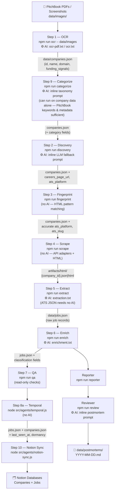
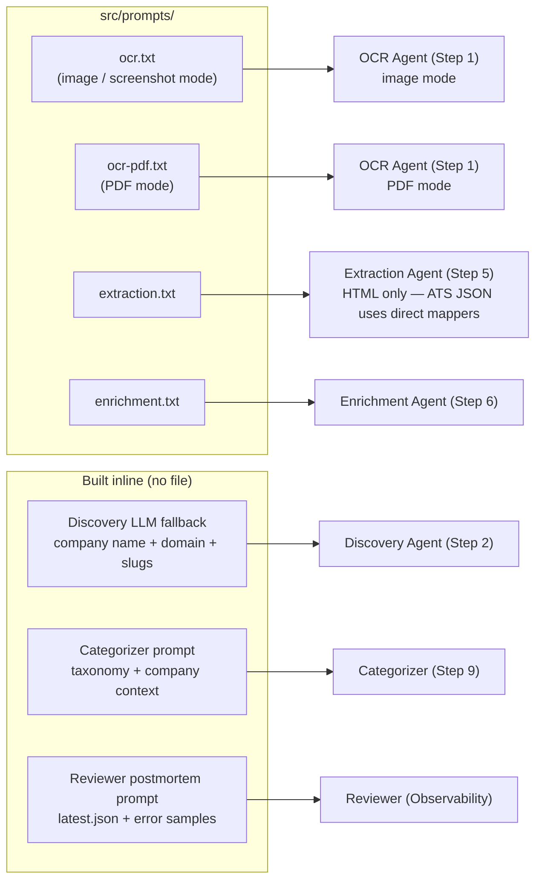

# CSB Job Board

Automatically finds and tracks job listings at climate-tech companies — pulled from PitchBook exports, enriched with AI, and synced to a Notion database you can search and filter.

**What you get:** A live Notion database of open roles at climate/clean-tech companies, each tagged with job function, seniority, location type, an MBA relevance score (0–100), a climate relevance flag, and an industry category from the Climate Tech Map taxonomy. New runs update existing records and mark removed jobs.

---

## Table of Contents

1. [Prerequisites](#prerequisites)
2. [Setup](#setup-one-time)
3. [Pipeline Overview](#pipeline-overview)
4. [Step-by-Step Reference](#step-by-step-reference)
   - [Step 1 — OCR: Import companies from PitchBook](#step-1--ocr-import-companies-from-pitchbook)
   - [Step 2 — Categorize: Tag companies by climate sector](#step-2--categorize-tag-companies-by-climate-sector)
   - [Step 3 — Discovery: Find careers pages](#step-3--discovery-find-careers-pages)
   - [Step 4 — Fingerprint: Identify job platforms](#step-4--fingerprint-identify-job-platforms)
   - [Step 5 — Scrape: Fetch job listings](#step-5--scrape-fetch-job-listings)
   - [Step 6 — Extract: Parse jobs into structured records](#step-6--extract-parse-jobs-into-structured-records)
   - [Step 7 — Enrich: Classify jobs with AI](#step-7--enrich-classify-jobs-with-ai)
   - [Step 8 — QA: Spot-check before syncing](#step-8--qa-spot-check-before-syncing)
   - [Step 9 — Temporal: Track job status over time](#step-9--temporal-track-job-status-over-time)
   - [Step 10 — Notion Sync: Push to Notion](#step-10--notion-sync-push-to-notion)
   - [Observability: Reporter + Reviewer](#observability-reporter--reviewer)
5. [Prompt Reference](#prompt-reference)
6. [Re-running Patterns](#re-running-patterns)
7. [Reading Results in Notion](#reading-results-in-notion)
8. [Troubleshooting](#troubleshooting)
9. [Data Files](#data-files)
10. [Security](#security)

---

## Prerequisites

- **PitchBook access** — to export company lists as PDFs or screenshots
- **Gemini API key** (paid tier) — powers OCR, job classification, and discovery heuristics. Get one at [aistudio.google.com](https://aistudio.google.com). Alternatively, an **Anthropic API key** runs all agents through Claude Haiku (see [Config / Multi-provider](#config--multi-provider))
- **Notion account** — two databases: one for Companies, one for Jobs. Run the setup script once to provision them (see Setup below)
- **Node.js 18+** — check with `node --version`
- **poppler-utils** — for PDF text extraction (`brew install poppler` on macOS)

---

## Setup (one time)

**1. Clone and install**
```bash
git clone <repo-url>
cd csb-job-board
npm install
```

**2. Create your `.env.local` file**
```
GEMINI_API_KEY=your-gemini-key
NOTION_API_KEY=your-notion-integration-key
NOTION_COMPANIES_DB_ID=your-companies-db-id
NOTION_JOBS_DB_ID=your-jobs-db-id
```

To get Notion credentials: create an internal integration at [notion.so/my-integrations](https://notion.so/my-integrations), share both databases with it, and copy the database IDs from the page URLs.

**3. Provision Notion databases**
```bash
node src/agents/notion-setup.js
```
Adds all required properties to your Notion databases. Safe to re-run.

---

## Pipeline Overview

The pipeline is a linear DAG. Each step reads from files written by the previous step — they're all idempotent and can be re-run independently.



### Where prompts are injected



---

## Step-by-Step Reference

### Step 1 — OCR: Import companies from PitchBook

**What it does:** Reads PitchBook exports (PDFs or screenshots) and extracts structured company records into `data/companies.json`. Re-running merges new companies with existing ones by domain — no duplicates.

**Input:** `data/images/` — drop PDFs or PNG/JPG screenshots here

**Output:** `data/companies.json` — company list with identity, funding signals, HQ, headcount

**Prompt injected:** `src/prompts/ocr-pdf.txt` (PDF mode) or `src/prompts/ocr.txt` (screenshot mode)

**PDF processing:** Large PDFs are automatically chunked into 8-page batches (configurable via `PDF_CHUNK_SIZE` env var) to stay within LLM output token limits. Each chunk is processed independently — a failure in one chunk doesn't lose the rest.

```bash
# Recommended: point at the directory (handles both PDFs and screenshots)
npm run ocr -- data/images

# Single PDF
node src/agents/ocr.js "data/images/250-500 climatecompanies.pdf"

# Dry-run: preview output without writing to companies.json
npm run ocr -- data/images --dry-run
```

**Schema fields produced:**
```
id                  — derived from domain (slugified), or name hash if no domain
name                — company name as extracted from PitchBook
domain              — website domain (e.g. "carbonplan.org")
funding_signals     — array of { date, deal_type, size_mm, total_raised_mm }
company_profile     — { sector, hq, employees, keywords }
```

---

### Step 2 — Categorize: Tag companies by climate sector

**What it does:** Assigns each company a climate-tech industry category from `data/climate-tech-map-industry-categories.json`. Makes one LLM call per unique company — PitchBook keywords, HQ, and company metadata are sufficient input. `data/jobs.json` is optional; run this immediately after OCR so category fields are available throughout the rest of the pipeline.

**Prompt injected:** Built inline — taxonomy categories + company name + sector + PitchBook keywords + scraped description

**Input:** `data/companies.json` + `data/climate-tech-map-industry-categories.json` (jobs.json optional)

**Output:** `data/companies.json` updated with:
```
climate_tech_category   — e.g. "Solar Energy", "Grid Infrastructure"
primary_sector          — e.g. "Clean Power"
opportunity_area        — e.g. "Generation"
category_confidence     — high | medium | low
```
Category fields are also stamped onto jobs at extraction time (Step 6).

```bash
npm run categorize

# Re-categorize all (including already-tagged)
npm run categorize -- --force

# Preview without writing
npm run categorize -- --dry-run
```

> **Taxonomy note:** `data/climate-tech-map-industry-categories.json` is the canonical taxonomy file. Do not auto-apply changes to it — any edits require human review.

---

### Step 3 — Discovery: Find careers pages

**What it does:** For each company in `companies.json`, attempts to discover its careers page URL. Skips companies already marked `careers_page_reachable: true` (use `--force` to re-run all).

**Input:** `data/companies.json`

**Output:** `data/companies.json` updated with `careers_page_url`, `careers_page_reachable`, `careers_page_discovery_method`, `ats_platform`

**Discovery order (per company):**
1. Standard path probing (`/careers`, `/jobs`, `/about/careers`, `/join`, etc.)
2. ATS slug guessing — checks `boards.greenhouse.io/{slug}`, `jobs.lever.co/{slug}`, `jobs.ashby.com/{slug}`
3. Homepage `<a href>` link scan — fetches homepage, finds career-related links
4. Sitemap scan — checks `/sitemap.xml`, `/sitemap_index.xml`
5. **LLM fallback** — fires even without homepage HTML; uses company name + domain + derived slugs. Prompt built inline.

```bash
npm run discovery

# Re-run all (including already-discovered)
npm run discovery -- --force

# Limit to first N companies (useful for testing)
npm run discovery -- --limit=20

# Verbose output (shows each method tried)
npm run discovery -- --verbose
```

---

### Step 4 — Fingerprint: Identify job platforms

**What it does:** Fetches each company's homepage and careers page and scans HTML for ATS fingerprints (script tags, API calls, CSS classes). Updates `ats_platform` and `ats_slug` so the scraper can route to the right API adapter.

**No AI involved** — purely pattern matching against known ATS signatures.

**Input:** `data/companies.json` — companies with `careers_page_reachable: true`

**Output:** `data/companies.json` updated with accurate `ats_platform` and `ats_slug`

**Detects:** Greenhouse, Lever, Ashby, Workday, Rippling, Jobvite, iCIMS, SmartRecruiters

```bash
npm run fingerprint
```

> **Why this step matters:** The scraper trusts `ats_platform` from this step for provider routing. Accurate ATS detection means structured JSON from official APIs instead of fragile HTML parsing.

---

### Step 5 — Scrape: Fetch job listings

**What it does:** Fetches raw job data from each company's careers page. Routes by `ats_platform` — uses official APIs when available, falls back to direct HTML, and uses headless Chromium (Playwright) as a last resort for JS-rendered pages.

**No AI involved** — HTTP fetch + API adapters.

**Input:** `data/companies.json` — companies with `careers_page_reachable: true`

**Output:**
- `artifacts/html/{company_id}.json` — structured job data (Greenhouse / Lever / Ashby / Workday)
- `artifacts/html/{company_id}.html` — raw HTML (direct scrape)
- `artifacts/html/{company_id}.playwright.html` — Playwright-rendered HTML fallback
- `data/scrape_runs.json` — per-run log with status, provider, and error info

**Provider routing:**
| ATS Platform | Method | Concurrency |
|---|---|---|
| Greenhouse | Official API (`boards-api.greenhouse.io`) | 5 |
| Lever | Official API (`api.lever.co`) | 5 |
| Ashby | Official API (`api.ashbyhq.com`) | 5 |
| Workday | Official API | 2 |
| Custom / Unknown | Direct HTML fetch + Playwright fallback | 3 |

```bash
npm run scrape
```

**Playwright fallback** fires automatically when: response is 4xx, body is under 5KB, or content-type is not HTML. Skips if the page matches known blocker patterns (CAPTCHA, cookie walls).

---

### Step 6 — Extract: Parse jobs into structured records

**What it does:** Converts raw artifacts into structured job records in `data/jobs.json`. For ATS API responses (JSON), uses direct field mappers — no LLM. For HTML artifacts, calls the LLM with `extraction.txt`.

**Prompt injected:** `src/prompts/extraction.txt` — HTML path only

**Input:** `artifacts/html/` — all artifacts from Step 4

**Output:** `data/jobs.json` — deduplicated job records (by `source_url` + `description_hash`)

```bash
# All companies
npm run extract

# Single company
node src/agents/extraction.js --company=<company-id>

# Single artifact file
node src/agents/extraction.js --input=artifacts/html/foo.html --base-url=https://foo.com --company="Foo Inc"

# Dry-run
npm run extract -- --dry-run
```

**Schema fields produced:**
```
id                  — hash of source_url + description
company_id          — links back to companies.json
job_title_raw       — title exactly as scraped
source_url          — direct link to the job posting
location_raw        — location string as shown
employment_type     — full_time | part_time | contract | intern | null
description_raw     — raw description text (first ~500 chars for HTML; full for API)
first_seen_at       — ISO timestamp of first extraction
last_seen_at        — ISO timestamp of most recent extraction
```

---

### Step 7 — Enrich: Classify jobs with AI

**What it does:** Classifies each job using the LLM. Skips jobs already enriched at the current prompt version unless `--force` is passed.

**Prompt injected:** `src/prompts/enrichment.txt`

**Input:** `data/jobs.json`

**Output:** `data/jobs.json` updated with classification fields

**Fields added:**
```
job_title_normalized    — standardized title (abbreviations expanded, level prefixes normalized)
job_function            — engineering | product | design | operations | sales | marketing |
                          finance | legal | hr | data_science | strategy | policy | supply_chain | other
seniority_level         — intern | entry | mid | senior | staff | director | vp | c_suite
location_type           — remote | hybrid | on_site | unknown
mba_relevance_score     — integer 0–100 (see rubric below)
description_summary     — 2–3 sentence summary
climate_relevance_confirmed — true | false
climate_relevance_reason    — one sentence explanation
```

```bash
npm run enrich

# 5x faster / lower cost: sends 5 jobs per LLM call
npm run enrich -- --batch-mode

# Re-classify jobs that errored on a previous run
npm run enrich -- --retry-errors

# Force re-classify everything (e.g. after editing enrichment.txt)
npm run enrich -- --force

# Tune concurrency and rate
npm run enrich -- --concurrency=5 --delay=1000
```

**Rate limiting:** Worker pool with `concurrency=3`, `delay=1500ms` between task starts, exponential backoff on 429/503, automatic fallback to `gemini-1.5-flash` on persistent failure.

> **Prompt versioning:** The enrichment prompt has a version constant (`ENRICHMENT_PROMPT_VERSION` in `src/agents/enricher.js`). Bump it after editing `enrichment.txt` to force re-enrichment of all jobs on the next run.

---

### Step 8 — QA: Spot-check before syncing

**What it does:** Read-only checks on `data/jobs.json`. Prints `[WARN]` lines for anything suspicious. Run this before Notion sync.

**No AI involved.**

**Checks:**
- Enrichment error rate (warns if >10%)
- Climate relevance distribution (warns if <30% confirmed)
- Missing required fields (`job_title_raw`, `source_url`, `company_id`)
- Jobs with no `mba_relevance_score`

```bash
npm run qa
```

---

### Step 9 — Temporal: Track job status over time

**What it does:** Compares the current job list against prior scrape runs to mark which jobs are still active, when they were removed, and how long they've been live. Also flags dormant companies (≥3 consecutive scrape runs with no jobs).

**No AI involved.**

**Input:** `data/jobs.json`, `data/scrape_runs.json`, `data/companies.json`

**Output:**
- `data/jobs.json` updated with `last_seen_at`, `removed_at`, `days_live`
- `data/companies.json` updated with `consecutive_empty_scrapes`, `dormant`

```bash
node src/agents/temporal.js

# Preview without writing
node src/agents/temporal.js --dry-run

# Verbose output
node src/agents/temporal.js --verbose
```

---

### Step 10 — Notion Sync: Push to Notion

**What it does:** Upserts all companies and jobs from the JSON files to Notion. Updates existing records by `id` — never duplicates. Uses a dynamic schema mapping that tolerates renamed Notion properties.

**No AI involved.**

**Input:** `data/companies.json`, `data/jobs.json`

**Output:** Notion Companies and Jobs databases updated

**Env vars required:** `NOTION_API_KEY`, `NOTION_COMPANIES_DB_ID`, `NOTION_JOBS_DB_ID`

```bash
node src/agents/notion-sync.js

# Dry-run: preview without writing
node src/agents/notion-sync.js --dry-run

# Only sync companies (skip jobs)
node src/agents/notion-sync.js --companies-only

# Only sync jobs
node src/agents/notion-sync.js --jobs-only
```

Rate-limited to ~3 req/s to stay within Notion API limits.

---

### Observability: Reporter + Reviewer

Run after any full pipeline run to get metrics and an AI-written postmortem.

**Reporter** — aggregates pipeline metrics into `data/runs/latest.json`:
```bash
npm run reporter
```
Tracks: per-provider scrape success rates, discovery yield, ATS distribution, enrichment error rate, climate relevance %, MBA score distribution, small body count.

**Reviewer** — reads `latest.json` + error samples → LLM writes a postmortem to `data/postmortems/YYYY-MM-DD.md`:
```bash
npm run review
```
Prompt built inline. Output: what went well, what failed and why, which stage had worst yield, one concrete prompt improvement suggestion.

> Reporter must run before Reviewer.

---

## Prompt Reference

| File | Used by | Purpose |
|---|---|---|
| `src/prompts/ocr.txt` | OCR Agent — image/screenshot mode | Instructs Gemini vision to extract PitchBook tabular data from a screenshot into a JSON array |
| `src/prompts/ocr-pdf.txt` | OCR Agent — PDF mode | Same goal but for `pdftotext`-extracted text; includes column truncation mappings and sidebar noise filtering |
| `src/prompts/extraction.txt` | Extraction Agent — HTML only | Extracts job listings (title, URL, location, type, description) from raw careers page HTML; strict anti-hallucination rules for URLs and descriptions |
| `src/prompts/enrichment.txt` | Enrichment Agent | Classifies a single job (or batch of 5 in `--batch-mode`) with function, seniority, location type, MBA score, climate relevance |

**Tuning tips:**
- Edit any prompt file and re-run the relevant agent.
- For enrichment: after editing `enrichment.txt`, bump `ENRICHMENT_PROMPT_VERSION` in `src/agents/enricher.js` and run `npm run enrich -- --force` to re-classify all jobs.
- Discovery and categorizer prompts are inline in their agent files (`src/agents/discovery.js` and `src/agents/categorizer.js`).

---

## Config / Multi-provider

All model defaults and key lookups live in `src/config.js`. Override per-agent via `.env.local`:

```bash
# Provider selection (auto-detected from available keys if omitted)
LLM_PROVIDER=gemini          # or: anthropic

# Keys
GEMINI_API_KEY=...           # paid tier required for full runs
ANTHROPIC_API_KEY=...        # setting this alone routes all agents through Claude Haiku

# Per-agent model overrides (Gemini)
OCR_MODEL=gemini-2.5-flash-lite
DISCOVERY_MODEL=gemini-2.5-flash
EXTRACTION_MODEL=gemini-2.5-flash
ENRICHMENT_MODEL=gemini-2.5-flash

# Per-agent model overrides (Anthropic)
OCR_ANTHROPIC_MODEL=claude-haiku-4-5-20251001
DISCOVERY_ANTHROPIC_MODEL=claude-haiku-4-5-20251001
EXTRACTION_ANTHROPIC_MODEL=claude-haiku-4-5-20251001
ENRICHMENT_ANTHROPIC_MODEL=claude-haiku-4-5-20251001
CATEGORIZER_ANTHROPIC_MODEL=claude-haiku-4-5-20251001
REVIEWER_ANTHROPIC_MODEL=claude-haiku-4-5-20251001

# PDF chunking (Step 1 — default: 8 pages per LLM call)
PDF_CHUNK_SIZE=8
```

---

## Re-running Patterns

**Add new companies from PitchBook exports** — drop new PDFs or screenshots into `data/images/`, then:
```bash
npm run ocr -- data/images
npm run categorize
npm run discovery
npm run fingerprint
npm run scrape
npm run extract
npm run enrich -- --batch-mode
node src/agents/temporal.js
node src/agents/notion-sync.js
npm run reporter && npm run review
```

**Refresh job listings only** — skip OCR and discovery, start from scrape:

Categorize is not needed when refreshing job listings only — company categories are already set; only re-run categorize when adding new companies.

```bash
npm run scrape
npm run extract
npm run enrich -- --batch-mode
node src/agents/temporal.js
node src/agents/notion-sync.js
```

**Re-enrich after editing the enrichment prompt:**
```bash
# 1. Edit src/prompts/enrichment.txt
# 2. Bump ENRICHMENT_PROMPT_VERSION in src/agents/enricher.js
npm run enrich -- --force
```

**Fix enrichment errors from a failed run:**
```bash
npm run enrich -- --retry-errors
```

---

## Reading Results in Notion

**MBA Relevance Score** — use this to filter for actionable roles:
| Score | What it means |
|---|---|
| 80–100 | Prioritize — strategy, BD, product leadership, GM, ops leadership, venture/finance |
| 60–79 | Worth reviewing — PM, marketing leadership, partnerships, supply chain |
| 40–59 | Senior IC engineering, data science, policy, mid-level ops |
| Below 40 | Primarily technical or entry-level; less typical for MBA recruiting |

**Climate Relevance Confirmed** — filter to `true` to exclude companies with no clear climate/energy connection.

**Days Live** — how long the posting has been open. Useful for prioritizing timely applications.

**Climate Tech Category / Primary Sector / Opportunity Area** — from the Climate Tech Map taxonomy. Filter to explore specific verticals (Solar, Grid Infrastructure, Carbon Removal, etc.).

---

## Troubleshooting

| Problem | Fix |
|---|---|
| `Missing GEMINI_API_KEY` | Add key to `.env.local`; paid tier required |
| `pdftotext: command not found` | `brew install poppler` (macOS) or `apt install poppler-utils` (Linux) |
| OCR returns 0 rows | Check PDF is a PitchBook "Companies & Deals Screener" export; try `--dry-run` to inspect raw output |
| OCR response truncated | Reduce `PDF_CHUNK_SIZE` (default 8) in `.env.local` |
| Enrichment errors on many jobs | Run `npm run enrich -- --retry-errors` |
| Discovery finds nothing for a company | Normal for early-stage companies; check `data/companies.json` for `careers_page_discovery_method: "not_found"` |
| Scrape returns empty for a company | May use CAPTCHA or JS rendering — check `data/scrape_runs.json`; Playwright fallback fires automatically |
| Notion sync fails with property errors | Re-run `node src/agents/notion-setup.js` to re-provision schema |
| Gemini daily quota hit mid-run | Discovery and enrichment save progress; re-run the same command tomorrow to continue |

---

## Data Files

```
data/
  companies.json              company list — careers URLs, ATS info, funding, categories
  jobs.json                   enriched job listings
  scrape_runs.json            log of every scrape attempt with status + errors
  runs/                       per-run summary JSONs + runs/latest.json
  postmortems/                AI-written run postmortems (YYYY-MM-DD.md)
  climate-tech-map-industry-categories.json   taxonomy (human-reviewed, do not auto-edit)

artifacts/
  html/                       raw scraped content per company (large; gitignored)
    {company_id}.json         structured jobs from ATS API
    {company_id}.html         raw HTML from direct scrape
    {company_id}.playwright.html   Playwright-rendered fallback

src/
  agents/                     one file per pipeline step
  prompts/                    AI prompt templates (edit to tune behavior)
  config.js                   all model defaults and key lookups
  llm-client.js               multi-provider LLM dispatch (Gemini + Anthropic)
```

---

## Security

Never commit `.env.local`. It contains API keys and is gitignored by default.
